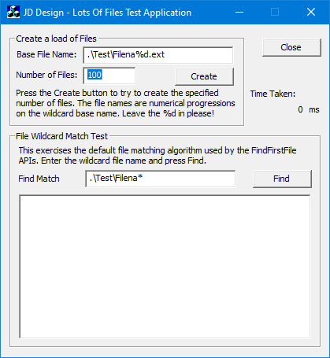

# LotsOfFiles - quickly create large numbers of zeo length files

This program can be useful if you need to test file enumeration code.

It also has a simple find files test to exercise the Win32 [FindFirstFile/FindNextFile APIs](https://learn.microsoft.com/en-us/windows/win32/api/fileapi/nf-fileapi-findfirstfilea).
